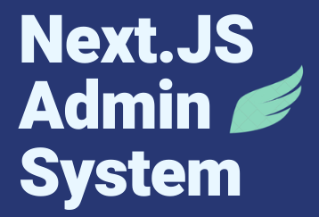
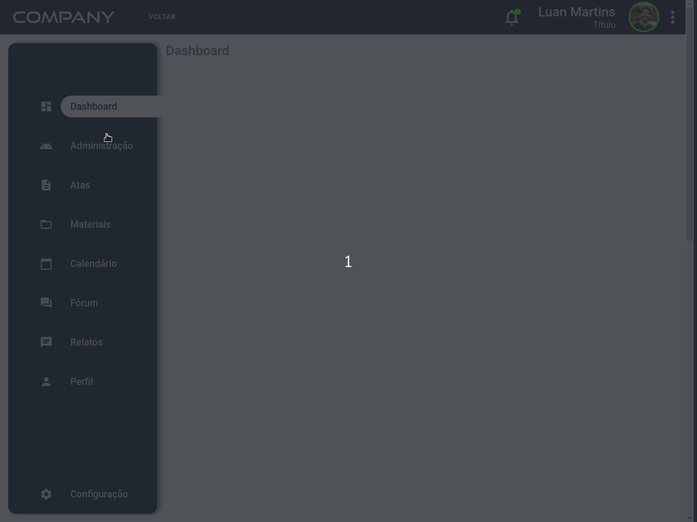
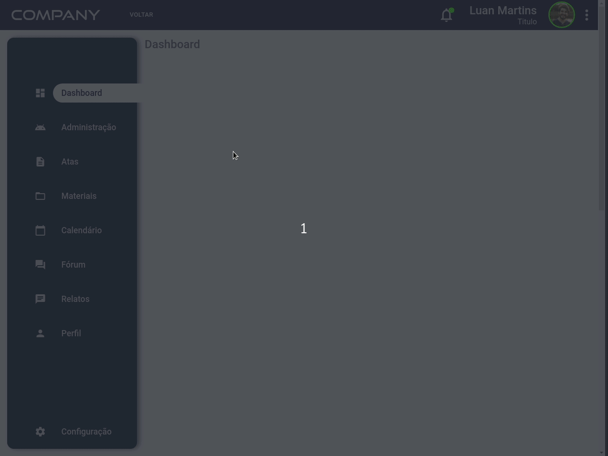

<h1 align="center">
   
  
    
</h1>

A minimal, clean and beautiful admin system

  
  

  
  
  
    

  <a href="#dizzy-roadmap">Roadmap</a> •

  <a href="#blush-why">Why</a> •
  <a href="#install-instructions">Install Instructions</a> •
  <a href="#zap-tech-stack">Tech Stack</a> •
  <a href="#handshake-contributing">Contributing</a> •  

  <kbd>
    
  </kbd>
  &nbsp;&nbsp;&nbsp;&nbsp;
  <kbd>
    
  </kbd>

## :blush: **Why?**

This was a challenge I had to create an admin system using NextJS for a company with all admin systems menus. I started this project as a simple template for admin systems but over time I started to implement other features like the profile menu and the user administration menu. I spent a lot of time on this project because I also used it to study new technologies and insert technologies that I have always wanted to play with.

## **Install instructions**

### Getting Started

#### 1) Clone & Install Dependencies on Linux/MacOS

- 1.1) `git clone https://github.com/luanrem/ramaapp`
- 1.2) `cd nextjs-adminsystem` - cd into your newly created project directory.
- 1.3) Install NPM packages with `yarn install`
        **Note:** I am using the `yarn` but you can use `npm` if you want.

#### 2) Clone & Install Dependencies on Windows

- 2.1) Open the Windows Powershell with Admin permission
- 2.2) `git clone https://github.com/luanrem/nextjs-adminsystem`
- 2.3) `cd next-adminsystem` - cd into your newly created project directory.
- 2.4) Install NPM packages with `yarn install`

#### 3) Start your app

- 3.1) **[yarn]** You need to run as development script `yarn dev`. The first time could take some time.

## :zap: **Tech Stack**

-   [ReactJS](https://reactjs.org/)
-   [Next.JS](https://nextjs.org)
-   [Typescript](https://www.typescriptlang.org)
-   [Styled Components](https://www.styled-components.com/)
-   [Material UI](https://material-ui.com/pt/)
-   [Framer Motion](https://www.framer.com/motion/)
-   [React-Use](https://github.com/streamich/react-use)
-   [React-custom-scrollbars](https://github.com/malte-wessel/react-custom-scrollbars)
-   [Nookies](https://github.com/maticzav/nookies)

and much more...

## :handshake: **Contributing**

This project is for study purposes too, so feel free to ask

All kinds of contributions are very welcome and appreciated!

-   ⭐️ Star the project
-   🐛 Find and report issues
-   📥 Submit PRs to help solve issues or add features
-   ✋ Influence the future of NextJS Admin system with feature requests
